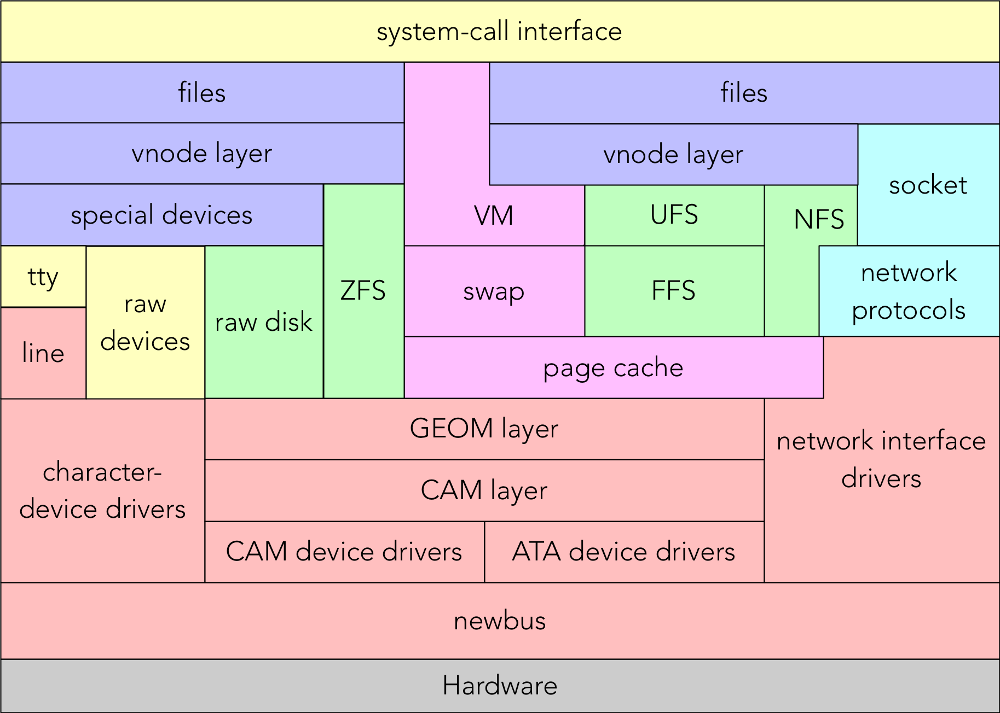

# Kernel Architectures
## Monolithic Kernels
- An OS architecture where the entire OS is working in kernel space
- Differs from other architectures in that it alone defines a high-level virtual interface over computer hardware
	- Syscalls implement OS services
	- Device drivers can be added as modules
- Some examples:
	- BSD, Linux, Solaris, other UNIX
	- MacOS and Windows (kinda)
	- FreeBSD I/O architecture:

## Some questions...
- What happens when your (user-mode) program dereferences an invalid pointer?
	- Program sent `SIGSEGV`: *segmentation fault*...
	- meaning **no such virtual address**
	- i.e., if unhandled, **terminate**

- i.e., User-mode program errors trigger segmentation faults, handled by the OS kernel
- What might happen if **kernel** code dereferences a bad pointer (e.g., a previously-freed object)?

## Microkernels
- Minimalistic Kernel Design
- Delegates most task to user space processes
- Microkernels like MINIX are popular, possibly embedded in Intel Platform Controller Hub.
- MacOS and Windows NT use hybrid kernel designs (almost micro-kernels).

### Functions:
- Control address spaces (low-level memory management)
- Inter-process Communication (IPC) for message passing
- Handling I/O and interrupts by sending messages to assigned ports.

### Pros:
- *Uniform interfaces* through message passing
- *Extensibility* for easy addition/modification of services
- *Flexibility* to add/remove services as needed
- *Portability* with less hardware-specific code
- *Reliability* as it's easier to get right and restart failing services

### Cons:
- *Performance impact* due to increased message passing

### Windows?
- Windows NT incorporates microkernel elements.
- Components like...
	- Executive
	- Hardware Abstraction Layer
	- device drivers
	- and graphics systems follow microkernel design principles.
- Despite being designed as a microkernel, Windows NT also includes non-microkernel components.

# Instruction Processing
- Typically processes one instruction at a time in a sequential manager
- **Pipelining** used for efficiency by overlapping instruction execution stages
- **Interrupts** may occer at any time, requiring processor to handle them during instruction processing

# Interrupt Handling
- When an interrupt is triggered, hardware disables interrupts to prevent further interruptions.
	- ***Why?*** To prevent further interruptions during handling the current interrupt.
- Hardware saves the *program counter* (**PC**) and *Processor Status Word* (**PSW**) or *Current Program Status Register* (**CPSR**).
	- ***Why?*** To preserve the state of the interrupted process..
	- ...which allows the processor to then resume execution from the correct point after handling the interrupt.
- The processor locates the interrupt handler...
	- ***How?*** By referencing a predefined interrupt vector table.
- ...software saves additional context...
	- ***What?*** such as register values, stack pointers, and other data related to the interrupted process.
	- Essential for maintaining the state of the interrupted process and ensuring seamless transition back to execution.
- ...and upon return, execution resumes.
- Hardware interrupts happen a bit, timer interrupts happen a lot

# Interrupted Interrupts
- Hardware and software steps for handling interrupts effectively
- i.e., if another interrupt comes in...
	- Sequential interrupts wait turn
	- Nested interrupts can interrupt the interrupt