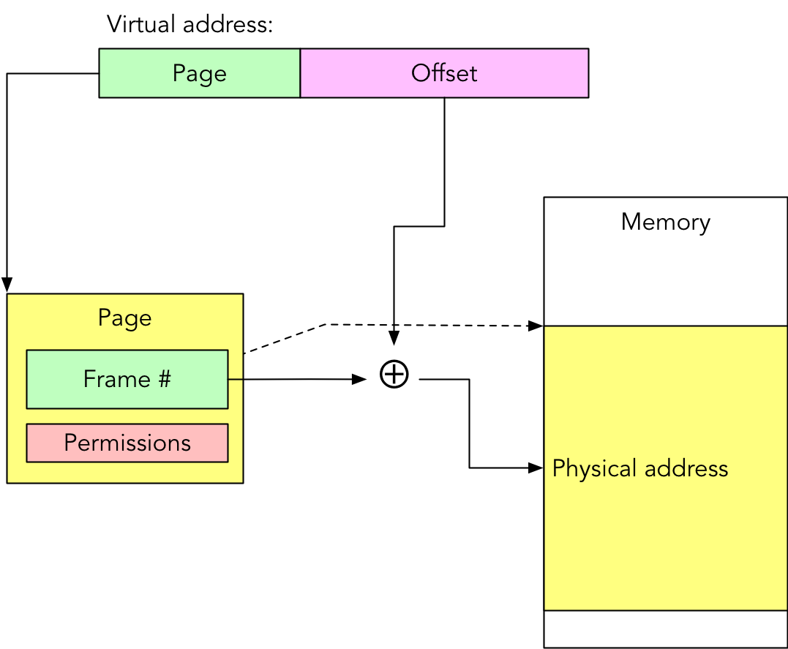

# Summary
- Paging partitions virtual and physical memory into fixed-size pages.
- Superpages in x86-64 omit last-level page table for up to 2 MiB pages.
- 64b Intel page table entry allows for bigger virtual addresses.
- Future advancements may include hardware bounds checking for security.

# MMU Goals
- **Relocation** for independence from physical address
	- ***Why?***: Program may not load in the same location every time, swap may no reload to same location..
- **Protection** with hardware checks
- **Sharing** when needed

# Mechanisms
- **Segments**: Variable-length blocks of memory, programmer-visible and controllable
- **Pages**: Fixed-length blocks of memory, invisible to programs
- Mechanisms can be combined

## Segmentation

- Divide process into unequal size *segments* with different values for *base*, *length*, and *protection*
- Programmer must be aware of maximum segment size
	- e.g., 64 KiB on 8086/8088!
- Introduced in 1960s with systems like Burroughs B5000 and Multics
- Intel 8086/8088 used fixed length, overlapping segments like...
	- **CS**: code segment
	- **DS**: data segment
	- **SS**: stack segment
	- **ES**: extra segment
- x64 architectures simplifies to $CS = DS = SS = ES = 0-2^{64}$
	- FS, GS still work

## Paging

- Partition **virtual memory** into fixed-size pages and...
- ...**physical memory** into *frames* of the same size
- Don't need to be stored in contiguous frames

## Important Differences

**Segmentation VS Paging**
- **Size**:
	- Segments are blocks of memory with variable lengths
	- Pages are fixed length
- **Visibility**:
	- Segments are visible to programs
	- Pages are not