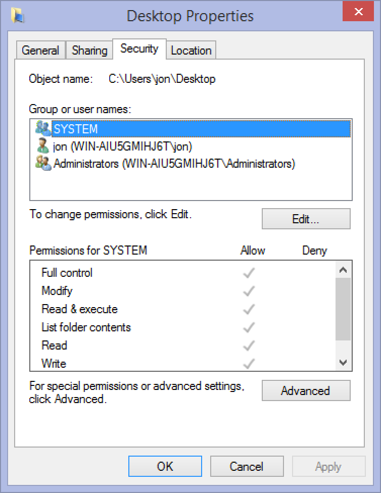

**Authorization:** Protection in Filesystems
# DAC: Discretionary Access Control
- **Organizing principle**:
	- Allows file owners to control access
	- i.e., owners say who gets access to files and directories
- **Major implementations**:
	- Unix permissions
	- Access Control lists (ACLs)

## Unix Permissions
- **Users**:
	- Identified by a numeric *user ID*
	- User-readable names in `/etc/passwd*`
- **Groups**:
	- Numeric *group ID* with names in `/etc/group`
	- Users can be members of multiple groups

### Querying user, group ID
Functions like and retrieve the current user's ID or group ID.
```c
#include <unistd.h>

uid_t	getuid(void);	# Get current user's ID
uid_t	geteuid(void);	# Get effective user ID (user permissions for file access)
gid_t	getgid(void);	# Get current user's group ID
gid_t	getegid(void);	# Get effective group ID (group permissions for file access)
```

### Unix File Permissions
```c
[jon website]$ ls
drwxr-xr-x   4 jon  jon     8B Mar 26  2017 assets
-rw-r--r--   1 jon  jon   948B Jan 26 15:37 config.yaml
drwxr-xr-x   8 jon  jon    10B Feb 13 23:19 content
-rwxr-xr-x   1 jon  jon   271B Jan 13  2017 deploy
drwxr-xr-x   7 jon  jon     9B Jan 22 23:14 layouts
drwxr-xr-x  12 jon  jon    13B Jan 24 16:18 static
```
- **Read, Write, Execute**: Each file has these permissions for each *owner*, *group*, and *other* users
- **Setting Permissions**: File owner can can set permissions with `[f]chmod(2)`

### Changing File Permissions
- **File Mode**: Expressed as an OR'ed bitmask of `S_IRUSR`, `S_IWGRP`, etc.
	- e.g., for *Octal*, `0644` (writable by owner, readable by anyone)
	- Can also be set with `chmod(1)`

### Changing File Group
- Restrict access to specific set of users
- Change which groups has access to a file with `chgrp(1)` or `chgrp(2)`
- Change group's permissions with `chmod(1)` or `chmod(2)`

### Changing File Owner
- File ownerhsip can be modified using `chown(1)` or `chown(2)`
- But, permission issues may arise:
```bash
$ chown alice foo.txt
chown: foo.txt: Operation not permitted
```

### Superuser
- Also known as `root` user with UID 0
- Has extensive privileges to change file ownership and permissions
- Can also mount filesystems, configure devices, load kernel modules, etc., **via system calls** (still user mode!)

### Root-only Programs
- Many tools require root privileges for tasks like...
	- filesystem management
	- package management
	- service control
- often via `sudo(8)`
	- `sudo` stands for **S**uper **U**ser **DO**


- Some programs require `root` privilege to run
- Others must be executable by any user
- Some are both!
- e.g., `login(1)`, `ping(8)`, and even `intel_backlight(1)`

## ACLs: Access Control Lists
- Alternative to discretionary access control
- Provides explicit list of users and groups with independent permissions for each.
- Used for complex authorization on multi-user shared systems
- Implemented in NFSv4, POSIX 1e, Windows/SMB, etc.



# MAC: Mandatory Access Control
- **Organizing principle**:
	- Sys admins define and enforce access policies
	- file owners cannot control or override these policies
- **Major implementations**:
	- Used when users *cannot be fully trusted*
	- Provides higher level of security by restricting access based on predefined rules

## MAC Examples
- **Early motivation**: Processes reading *Top Secret* data cannot write to *Secret* files
- **Later motivation**: Processes reading *low-integrity* data cannot write to (e.g., network input) *high-integrity* files (e.g., sysconfig)
- **Later Application**: Process belonging to one application cannot read or write files belonging to another application

# Capabilities
- Third, orthogonal access control method
- **Unforgeable tokens of authority** that convey specific authorities regarding **specific objects**
- Not permissions or entitlements...
- ...rather, a means of expressing the principle of least authority
- Modifiable with monotonic reduction
- **Language-level Example**: Java references
- **System Example**: File descriptors
	- references are **unforgeable**
	- refer to **specific objects**
	- **NOT** alterable with monotonic reduction
	- **DO NOT** convey **specific authorities** (see `fchmod(2)`)