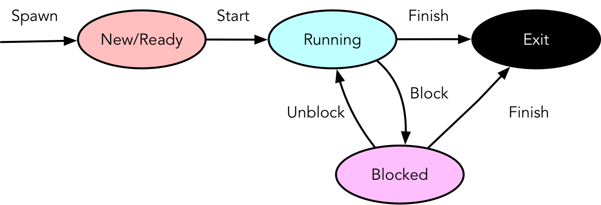

# Chapter 1: Introduction
# What do OS' do?
- Process execution, scheduling
- Inter-process communication
- Hardware I/O
- Hardware abstraction
- Filesystems
- Access control (system, files, memory, devices)
- Accounting

Operating systems mediate software access to resources, whether concrete (disk space, I/O devices) or abstract (time, security)

# "Real-Time" Operating Systems?
- **Predictable** behaviour
- Notable deadlines that need to be met, with clear **priorities** of various tasks
- Tasks are **periodic**

###  Hard real-time ("or else"):
- Has hard deadlines (emphasis on dead)
- *Example*: cars, planes, mars robots, etc.

### Soft real-time ("mostly"):
- Has soft deadlines
	- i.e., deadlines are important (mostly)
	- but slippage is acceptable
	- *Example*: Frame drops in HQ video stream
- *Example*: A/V, transactions, simulation

### Non-real-time
- Everything else!

# Important concepts
- Interrupts
- Memory and I/O interfacing
- Multiprocessing
- Privilege modes
- Virtual memory
	- Virtual and physical addresses
	- Page tables and TLBs

# Chapter 2: Processes
# Processes
- **Memory Allocation**: Running programs need memory for code, global variables (`.bss`), the stack, and the heap.
- **Virtual address**: Address used directly by software
- Processses are *unprivileged*

# Privilege
- **Supervisor mode**: Access to privileged instructions
- **User mode**: No privileged instructions
	- Attempting to execute a privileged instruction fromm user mode results in a *trap* (type of interupt)
- Mode indicated by bits in *status register*
- Mode changes on interrupt handling, system calls, or other traps

# Privilege Rings
- A mechanism represented by layers used to enforce different levels of access and permissions for software components running on a system.
- Represented in numerical values. The lower the number, the higher the privilege.
- Number of rings is dependent on architecture.
- Most common implementation has four rings:
	- **Ring 0**: Kernel Mode
		- Highest privilege level.
		- Unrestricted access to system resources.
		- Can execute privileged instructions.
		- Critical system functions such as memory management, process scheduling, device I/O handling.
	- **Rings 1 & 2**: Reserved
		- Intermediate privilege levels.
		- Could be unused or reserved for future expansion
		- Most commonly used for device drivers, not so common in modern systems.
	- **Ring 3**: User Mode
		- Lowest privilege level.
		- User-space applications run in this ring
		- Process' have limited access to system resources and cannot directly execute privileged instructions.
		- Process' here rely on system calls to request services from kernel. Kernel performs operations on their behalf.

# Unprivileged processes
**System calls**:
- How unprivileged processes perform privileged operations
- Privileged system (*kernel*) code called by unprivileged (*user*) process
- Note called like ordinary functions:
	1. Set arguments (including syscall #) in registers or memory
	2. Invoke interrupt or syscall instruction

# Chapter 3: File Abstractions
# Virtualization
- **Time-sharing**: Each user has the impression of working on a dedicated computer.
- **Virtual memory**: Each process has the impression of a dedicated address space.

# Files*
- An array of bytes that *persist*.
- Can be found via a *path*.
	- Paths can be used to look up files...
	- ...but files and paths change independently
		- file contents can change w/o changing path
		- path can change w/o changing file
- No user-meaningful names.

# Directories
- Set of entries $(n \to i)$
	- $n$: user-meaningful name
	- $i$: file's *inode*
	- **e.g.**: `foo.c`$\to 925551$
- Basically just contains a list (entry name, inode number) of pairs.
- Maps names to *inodes*.
- For each file or directory in a given directory, there is a string and a number in the data blocks(s) of the directory.

### *Example*:
Directory `dir` (inode #5) has three files:
	-  `foo` (inode #12)
	-  `bar` (inode #13)
	-  `foobar` (inode #24)

The on-disk data for `dir` might look like this:
| inum | reclen | strlen | name   |
|------|--------|--------|--------|
| 5    | 12     | 2      | .      |
| 2    | 12     | 3      | ..     |
| 12   | 12     | 4      | foo    |
| 13   | 12     | 4      | bar    |
| 24   | 36     | 28     | foobar |

Each directory has two extra entries:
- "dot" `.`: current directory (`dir` in this case).
- "dot-dot" `..`: parent directory (`root` in this case).

# inode
- **index node**: Integer index that names a location on a disk. The true and realest name a file has.
- Data structure that describes the structure that holds the metadata for a given file or directory (length, permissions, location).
- Used to identify files and directories.

# Process File Abstractions
Can use *syscalls* to open, close, read, write, etc.
```c
/* Open or close a file: */
int      open(const char *, int, ...);
int      close(int);
```
```c
/* Sequential reading and writing: */
ssize_t  read(int, void *, size_t);
ssize_t  write(int, const void *, size_t);
````
```c
/* Random reading and writing: */
off_t    lseek(int, off_t, int);
ssize_t  pread(int, void *, size_t, off_t);
ssize_t  pwrite(int, const void *, size_t, off_t);
```
```c
/* Directories and metadata: */
int      mkdir(const char *, mode_t);
int      rename(const char *, const char *);
int      stat(const char *, struct stat *);
int      unlink(const char *);
```

# File I/O SysCalls

### From a process' perspective
- syscalls are C functions.
- files are named by **file descriptors** (e.g., FD 3)

# File Descriptors
- An integer that acts as a reference to open a file within a process.
- Indices into a kernel array.
- Each process has its own file descriptor array
	- i.e., my FD 4 **!=** your FD 4

# Chapter 4: Process Control
# I/O syscalls
```c
/* Open or close a file: */
int     open(const char *path, int oflag, ...);
int     openat(int fd, const char *path, int oflag, ...);
int     close(int fildes);
```
```c
/* Sequential reading and writing: */
ssize_t read(int fildes, void *buf, size_t bytes);
ssize_t write(int fildes, void *buf, size_t bytes);
```
```c
/* Randm reading and writing: */
off_t   lseek(int fildes, off_t offset, int whence);
ssize_t pread(int fildes, void *buf, size_t bytes, off_t offset);
ssize_t pwrite(int fildes, void *buf, size_t bytes, off_t offset);
```
```c
/* Metadata: */
int     ftruncate(int fildes, off_t length);
int     fstat(int fildes, struct stat *buf);
int     stat(const char *, struct stat *);
int     truncate(const char *path, off_t length);
```

# Directory syscalls
```c
/* Directory creation: */
int     mkdir(const char *path, mode_t mode);
int     mkdirat(int fd, const char *path, mode_t mode);
```
```c
/* Moving/removing files in/from directories: */
int     rename(const char *old, const char *new);
int     renameat(int fromfd, const char *from, int tofd, const char *to);
int     unlink(const char *path);
int     unlinkat(int fd, const char *path, int flag);
```
```c
/* Current working directory: */
int     chdir(char *path);
int     fchdir(int fd);
```
```c
/* Directory inspection (used by readdir(3) and friends): */
int     getdirentries(int fd, char *buf, int nbytes, long *basep);
```

# Process Creation
## Two step process:
1. Clone current process
2. Start running new program
	- **`fork(2)`**: Creates a new *child* process with:
		- new process ID (**PID**)
		- same memory contents as parent
		- its own copy of the same file descriptors
		- *Note*: Child's memory may be copied from parent, but much more efficient to create *copy-on-write* mappings to physical memory...
		- ... If either attempts to write to memory, a copy is made so both processes can have their own private copies of the data.
	- **`exec(2)`**: Transforms process into different program:
		- new executable code
		- fresh memory regions
		- **Still the same process**:
			- same PID as parent process
			- same working directory

# Process Termination
## `kill(2)`: Send signal to a process
- `kill(pid_t pid, int sig)`
- Sends a signal `sig` to a process `pid`.
	- Most obvious one is to terminate a process.
- Can be used to check the validity of `pid`.

## Signal Handling
- Allows processes to respont to events or interrupts (signals)
- `sigaction(2)` is used by a process to specify how they want to handle signals.
- Common signals:

| Signal  | Default Action | Description                     |
|---------|----------------|---------------------------------|
| `SIGHUP`  | terminate      | terminal line hangup            |
| `SIGKILL` | terminate      | kill program (can't be handled) |
| `SIGBUS`  | dump core      | bus error                       |
| `SIGSEGV` | dump core      | segmentation violation          |
| `SIGPIPE` | terminate      | write on a pipe with no reader  |
| `SIGTERM` | terminate      | software termination signal     |

## `wait(2)`: Wait for a process to end
- `wait(int *stat_loc)`
- This function suspends execution of its calling process until `stat_loc` information is available for a terminated child process, or a signal is received.
- On return, the `stat_loc` area contains termination information about the process that exited.
- *More*: `man 2 wait`
- Why process ended?

| Test          | Meaning                                 | Results                                        |
|---------------|-----------------------------------------|------------------------------------------------|
| `WIFEXITES`   | normal termination via exit(3)          | can retrieve exit status<br>with `WEXITSTATUS` |
| `WIFSIGNALED` | terminated by signal                    | can retrieve signal<br>with `WTERMSIG`         |
| `WIFSTOPPED`  | not actually terminated;<br>restartable | can retrieve signal<br>with `WSTOPSIG`         |

# Chapter 5: Memory Allocation
**Memory Allocation**: Allocating portions of computer's memory to progress or processes for them to use.

# Types of Memory
- **Stack**: Allocations/deallocations managed *implicitly* by the compiler
	- Also called **automatic** memory
	- Data or information that you want to live beyond the call invocation should not be left on the stack.
	- *Example*: Allocating an integer on stack
```c
void func() {
	int x;	// declares an integer on the stack
	...
}
```
- **Heap**: Allocations/deallocations handled *explicitly* by programmer.
	- Provides more challenges to both users and systems.
	- *Example*: Allocating an integer on heap
```c
void func() {
	int *x = (int *) malloc(sizeof(int));
	...
}
```
Observing the code above, we can point out the following
- Both stack and heap allocation occurs:
	- `int *x`: Compiler makes room for a pointer to an integer.
	- `malloc()`: Program requests space for an integer on the heap.
- The routine retunrs the address of integer (on success, `NULL` on failure), which is then stored on the stack.

## Applications
- **Dynamic Allocation**:
	- Arbitrary sizes
	- Arbitrary lifetimes
- **Allocators**
	- Manage the heap
	- Must be *fast*
	- Must *reclaim* memory

# Memory Allocation API
## `malloc(3), calloc(3), realloc(3)`, etc.
- Allocate $N$ bytes of heap memory.
- Aligned in a way that is can allocate any data type.
- Result: `void*`
- **`malloc()` call**:
	- Pass it a size asking for room on the heap.
	- Success--returns pointer to newly-allocated space.
	- Failure--returns `NULL`.

## `free(3)`
- Releases memory for general use again.
- i.e., frees allocation created via `malloc(), calloc(), etc.`
- No size: must be stored by allocator

# Memory Management
- **Garbage collector**: Mechanism to automatically manage memory used by programs, cleaning and reclaim memory no longer needed by the program.
	- Helps deal with memory leaks or manual memory management.
- **Buffer overflow**: Not allocating enough memory.
- **Uninitialized read**: Can happen when you call `malloc()` properly but forget to fill in values into the data type.
	- i.e., reads data of unknown value from heap.
- **Memory leak**: Essentially forgetting to free memory.
- **Segmentation fault**: Usually refers a program attempting to access a memory location it can't access or forgetting to allocate memory.
- **Dangling pointer**: When a program frees memory before it's finished using it.

# Free-Space Management
- **Free List**:
	- List of ranges of physical memory currently not in use.
	- Data structure used to track unallocated memory.
	- Not necessarily a list.
- **Fragmentation**: When memory is divided into smaller chunks that it becomes difficult to allocate large blocks of memory, even when there is enough free memory.
	- **Internal**: Within blocks
		- Allocated memory blocks larger than actual amount of memory needed by process (excess space).
		- Excess remains unused and can't be allocated by other processes (inefficient memory utilization).
	- **External**: Between blocks
		- Free space gets cut to small pieces.
		- Think of it as physical memory becomes full of little chunks of free space, that it becomes difficult to allocate new segments or grow existing ones.

### Where does memory come from?
- **Userspace answer**: From the kernel
- **Kernel answer**: Self-management of phsical memory

|             |                               |
|------------:|-------------------------------|
| **Buckets** | points into...                |
|   **Zones** | that take from...             |
|    **Kegs** | composed from...              |
|   **Slabs** | located in...                 |
|  **Arenas** | which makes up...             |
| **Submaps** | in a virtual address space... |


# Allocation Strategies
- **Best fit**: Search through free list and find chunks of free memory as big or bigger than the requested size.
	- Return smallest chunk out of the possible candidates.
	- Requires full walk of free list, but one pass is enough.
- **Worst fit**: Opposite of best fit. Find largest chunks.
	- Keeps large free block contiguous.
	- Also requires full walk of free list.
	- Terrible performance and could result in excess fragmentation while still having high overheads.
- **First fit**: Finds first block big enough and returns requested amount ot user.
	- Allows early search termination (i.e., very fast).
	- But pollutes the beginning of free list with small objects.
- **Next fit**: Continuation of first fit, where instead of starting from the beginning, algorithm starts search from where we left off.
	- Keeps an extra pointer to the location last referenced.
	- Similar performance to first fit.

# Allocation Size
## How much memory is needed to store $N$ bytes?
- $N$ bytes + per-allocation header + possible free list entry
- *... and maybe round up?*
- **Exact**: External fragmentation
- **Constant**: Internal fragmentation
- **Balance**: Power of two

# Buddy Allocation
- Divides memory into fixed-size blocks:
	- Divides free space by two until a block big enough to accommodate request is found.
	- Each block is referred to as a "*buddy*"class.
- Allocates memory in powers of two:
	- Free memory is seen as a big space of size $2^N$ (e.g., 4KB, 8KB, 16KB).
	- *Example*: Process requests 10KB, allocator allocates 16KB, the smallest available size.
- Implements splitting and coalescing:
	- When larger block allocated, it's split into smaller blocks if necessary.
	- Conversely, when a lock is deallocated, allocator checks if its busy (adjacent block of same size) is also free. If so, buddies coalesced into larger block.
- **MATH & LOGIC**:
	- if $2^{U-1} \lt s \lt 2^U$, allocate entire block.
	- else, split block into equal buddies until $2^{k-1} \lt s \lt 2^k$
	- coalesce buddies of size $2^{i-1}$ when they become free


# Slab Allocation
- Array of constant-size objects, bitmask of allocations
- Initialize on first allocation
- Freed objects **returned to pool** for **later reuse**
- Not helpful for general (arbitrary-size) allocations

# Chapter 6: Shells
# Shell
- Command interpreter
- Accepts user commands, executes them
	- A UNIX **shell** commonly uses `fork()`, `wait()`, and `exec()` to launch user commands.
- With redirection, pipes, flow control, heredocs, scripting, job control...
	- The separation of fork and exec enables features like **input/output redirection**, **pipes**, etc., without changing anything about the programs being run.

# POSIX Shell
- **POSIX**: Portable Operating System Interface
	- Set of standards specifying the interface between a Unix-like OS and user programs.
- A POSIX shell adheres to POSIX standard for shell syntax, built-in commands, environments variables, and other shell features.
- Provides consistent and portable environment for executing commands, scripting, and interacting with OS.

## Redirection:
- The ability to change where input comes from and where output goes to in a command line.
	- *Example*: `command > output.txt`
	- Redirection achieved with `<`, `>`, and `>>`
- Output `stdout` or `stderr` to a file.
- Done with `dup2(2)`

## Pipes
- Connection between two processes.
	- *Example*: `$ echo "Hello, old friend. | cowsay`
	- `|` character used to represent pipe.
	- `echo "Hello, old friend."` is passed as input to `cowsay`
- Output from one program becomes the input another (one way).
- **`pipe(2)`**: creates a descriptor for reading and one for writing
- **`dup(2)`**: sets up stdout/stdin
- File descriptors inherited across `fork(2)` and `execve(2)`.

## Job Control
- Ability to manage multiple processes running within shell environment.
- Command execution is normally synchronous. Shell waits (`wait(2)`) for completion of the child process
- `&` runs command *in the background*; `Ctrl+Z` moves current command to the background
- built-in `jobs` command lists jobs that can be *foregrounded* with `fg` or killed with `%1` or `%2`
- `Ctrl-C` sends `SIGTERM`

## Environment Variables
- Variables set in shell environment and inherited by child processes.
- Used to store information such as *sysconfig*, *user prefs*, *runtime params*.
- *Examples*:
	- `PATH`: Specifies directories to search for exec files
	- `HOME`: Specifies user home directory
	- `LANG`: Specifies language and locale settings

## Heredocs
- Allows you to pass multiple lines of input into command or script w/o using external file.
	- i.e., can construct a temporary file *in memory*.
- Can be represented using `<<`
- *Example*:
```bash
cat << END
This is line 1
This is line 2
END
```

## Flow Control
- Lets you control execution flow of a script or program based on conditions.
	- Constructs (`for`, `while`)
	- Conditionals (`if`, `case`)
	- and Function Definitions
- Allows you to make decision, repeat actions, and organize execution of commands in a script
	- i.e., sequential conditional execution

## Scripting
- Lots of useful things can be expressed in shell
- Don't want to type same commands repeatedly? Save shell commands in a ***shell script***.
- script **directly executable** with `#!` ("*shebang*")

# Chapter 7: Inter-Process Communication
# Pipes
- Creates unidirectional stream of bytes.
- Can `read(2)` from first FD, `write(2)` to second.
- File descriptors inherited across `fork(2)` and `execve(2)` can be shared across local sockets.
```c
int	pipe(int fildes[2]);
```

# FIFOs
- "Named pipes", where two processes communicate w/ each other by establishing a named channel or pipe.
- Instead of using `|` like pipes, FIFOs exist as file that can be accessed by multiple processes.
	- Like regular files, have permissions and can be created, opened, read, and written by a process.
	- i.e., a pipe that appears in the filesystem instead of just the shell.
- Unidirectional, but can use two FIFOs to achieve bidirectional communication.
- Can be inherited, shared, or opened (`open(2)`).
	- Allows processes to rendezvous within constraints of filesystem permissions

# Sockets
- API used as an endpoint for network communication between two machines/processes over a network.
- Allows simultaneous communication locally or across a network.
- Networking applications:
	- Client-server communication
	- P2P communication
	- Inter-process communication (IPC)

## Local Sockets
```c
// Common:
int     socket(int domain, int type, int protocol);
```
```c
// Server side:
int     bind(int s, const struct sockaddr *addr, socklen_t addrlen);
int     listen(int s, int backlog);
int     accept(int s, struct sockaddr * restrict addr, socklen_t * restrict addrlen);
```
```c
// Client side:
int     connect(int s, const struct sockaddr *name, socklen_t namelen);
```

### Why local sockets?
Well... Unlike FIFOs:
```c
ssize_t sendmsg(int s, const struct msghdr *msg, int flags);
ssize_t recvmsg(int s, struct msghdr *msg, int flags);
```
- `struct msghdr` $\to$ `struct cmsghdr`: **ancillary data**
	- **Ancillary data**: additional metadata that can be sent along w/ main data payload.
- ancillary data can include extra information
	- i.e., Allows applications to convey extra information related to transmitted data:
		- File descriptors
		- Access rights
		- etc.
- using local sockets, ability to share data **and files**

In other words...
- Local sockets offer more advanced features, better performance, and flexibility.
- Better suited for IPC scenarios.

# System V IPC
- **Purpose**: Provides a mechanism for communication and synchronization between processes.
- Introduced new local IPC objects:
	- Semaphores
	- Message queues
	- Shared memory
- **Flat numeric namespace**: Each IPC object is identified by a unique int key. This key handles access to IPC object.
	- Like a file descriptor... but not?!
```c
int hopefully_unique = 472593;
key_t key = ftok("/usr/local/share/foo/bar", hopefully_unique);
if (key == -1) { /* ... */ }
```

# System V Semaphores
- **Purpose**: Synchronization mechanism used to control access to shared resources between multiple processes.
- **Semaphores shared by multiple processes**: Typically used to coordinate access to shared resources (files, memory, hardware)
- Work on **arrays of semaphores**
### Operations:
```c
int     semget(key_t key, int nsems, int flag);			// Create new or obtain existing semaphore set
int     semop(int semid, struct sembuf *array, size_t nops);	// Performs semaphore operations on semaphores within a semphore set
int     semctl(int semid, int semnum, int cmd, ...);		// Controls and queries properties of semaphore sets (setting values, deleting sets)
```

# System V Message Queues
- **Purpose**: Queues for sending and receiving **tagged** data
- **Tagged Data**: Identifiers that enable processes to filter and process messages based on tags
- **Usage**:
	- **IPC**: Allow processes to exchange data and coordinate activities in a structured manner
	- **Assynchronous Communication**: Allow processes to send and receive messages independently of each other.

### Operations:
```c
int     msgget(key_t key, int msgflg);		// Create new or obtain existing message queue
int     msgsnd(int msqid, const void *msgp, size_t msgsz, int msgflg);		// Send messages to queue
ssize_t msgrcv(int msqid, void *msgp, size_t msgsz, long msgtyp, int msgflg);	// Receive messages from queue
int     msgctl(int msqid, int cmd, struct msqid_ds *buf);		// Control and manage message queues (delete, retrieve info)
```

# POSIX IPC
- **The Good**: Simple API
	- keys and IDs $\to$ file descriptors; better names

| System V | POSIX                  |
|----------|------------------------|
| `semget` | `sem_open`             |
| `semop`  | `sem_post`, `sem_wait` |
| `msgget` | `mq_open`              |
| `shmat`  | `mmap`                 |

- **The Bad**:
	- Paths look like filesystem paths, **but are not**
	- the following works even if:
		- `int shm = shm_open("/foo/bar/shm.example", /* ... */);`
			- there is no `/foo/bar`
			- there is, but no permission to access
		- `/foo/bar/shm.example` might not necessarily correspond to an actual file path.

# POSIX IPC vs System V IPC
- **For POSIX**:
	- Clear paths better than `ftok(3)`
	- File descriptors better than file-descriptor-like handle
		- Simplifies resource management and more consistent with other file-based operations
- **For SysV**:
	- Semaphore cleanup semantics
		- Clearer or better defined semaphore cleanup semantics compared to POSIX IPC

# POSIX Shared Memory
- FreeBSD *anonymous shared memory* via `SHM_ANON` flag.
	- Allows creation of shared memory region without need for backing files.
- Linux more recently added `memfd_create(2)` syscall.
	- Alternative for creating anonymous shared memory regions.
- Creates shared memory referenced **only** by descriptor.
	- Unlike System V Shared Memory, no associated keys or identifiers.
- Sharing is explicit; risk of namespace race eliminated.
	- Processes must explicitly request access to shared memory region.
- Part of Capsicum security extensions.

# Summary
## Inter-process Communication (IPC)
- Always **explicit**: not by accident!
- Mechanisms:
	- Pipes and FIFOs
	- Sockets
	- SysV and POSIX IPC:
		- Semaphores
		- Message queues
		- Shared memory

# Chapter 8: `init` Systems
# Process Parentage
- Where do new processes come from?
	- New processes are typically  `fork(2)`'ed from a parent proces...
	- ...which can be traced back recursively to an `init` process initiated by the kernel during system boot.
- i.e., process parentage traces back to an `init` process initiated by the kernel.

# System Startup
- The boot process involves firmware, bootloader, kernel, and the `init` system.
	- Power on
	- processor executing ***firmware*** at known address (`[EEP]ROM` connected to a address bus)
	- firmware loads ***bootloader***
	- bootloader loads ***kernel***
	- kernel starts ***`init` system***, responsible for managing system's startup tasks

# `init` System
- `init` plays a crucial role in managing the system's startup and initialisation process.
- The system (typically `PID 1`) serves as the root of the process tree and finishes booting the system by handling tasks:
	- mounts filesystems
	- starts terminal (`tty`) device managers
	- starts network services
	- starts graphical login services
	- etc.

## BSD `init`
- Offers two -user modes for system startup:
	- **Single-user mode**: forks a shell (`/bin/sh`) for troubleshooting purposes.
	- **Multi-user mode**: the *"normal"* system startup
		- forks a shell for `/etc/rc`
			- loads settings from config files (`/etc/defaults/rc.conf`)
			- overrides config (`/etc/rc.conf`)
			- runs scripts from `/etc/rc.d` with `rcorder(8)`
		- starts terminal login services (read `/etc/ttys`: start `getty(8)` $\to$ `login(1)`)

## SysV `init`
- Uses **runlevels** with start/stop scripts for each level:

	| Runlevel | Meaning                |
	|----------|------------------------|
	| 0        | Halt             |
	| 1        | Single user mode |
	| 2        | Default for AIX, SVR3, SVR4 |
	| 3        | Default for Gentoo, HP-UX, Slackware... |
	| 5        | Graphical (X) |
	| 6        | Reboot        |

- Startup scripts are help in `/etc/init.d`, with symbolic links to directories like `/etc/rc.d/rcN.d` indicating services associated with specific runlevels
- Each runlevel has a directory (like `/etc/rc.d/rc4.d`)
	- Symbolic links to scripts in `/etc/init.d`
	- symlink implies services "part of" runlevel
- Can change runlevel: `init 3`. `init 4`. etc.
	- Identifies set differences between runlevels
	- runs `etc/rc.d/rcN.d/foo stop` or `start`

# `launchd`
- A process introduced by Apple in 2005 for Mac OSX 10.4 Tiger
- Replaces `init` and `inetd`
- Listens to network ports listed in `/etc/inetd.conf` and...
- ...starts process to serve requests upon connection
	- Therefore unifying service discovery by name or connection

# `systemd`
- A system and service manager that serves as the core manager for various system components:
	- services
	- sockets
	- mounts
	- timers
	- etc.
- Devekioed starting in 2010 and has been adopted by several Linux distros since 2011
- Incorporates elements of different system components:
	- `init`
	- `inetd`
	- `syslog`
	- `login`
	- `cron`
	- devices
	- networking
	- temporary files
	- boot
	- etc.
- Apparently *hugely controversial*...

# Present Day...
- Today, there are ongoing developments in the realm of `init` systems.
- With alternatives to `systemd` being explored such as...
	- `jobd`
	- `nosh`
	- `OpenRC`
	- `procd`
	- `runit`
	- and `S6`
- The landscape remains dynamic and evolving with new possibilities

# Chapter 9: Kernel Architectures
# Kernel Architectures
## Monolithic Kernels
- An OS architecture where the entire OS is working in kernel space
- Differs from other architectures in that it alone defines a high-level virtual interface over computer hardware
	- Syscalls implement OS services
	- Device drivers can be added as modules
- Some examples:
	- BSD, Linux, Solaris, other UNIX
	- MacOS and Windows (kinda)
	- FreeBSD I/O architecture:


## Some questions...
- What happens when your (user-mode) program dereferences an invalid pointer?
	- Program sent `SIGSEGV`: *segmentation fault*...
	- meaning **no such virtual address**
	- i.e., if unhandled, **terminate**


- i.e., User-mode program errors trigger segmentation faults, handled by the OS kernel
- What might happen if **kernel** code dereferences a bad pointer (e.g., a previously-freed object)?

## Microkernels
- Minimalistic Kernel Design
- Delegates most task to user space processes
- Microkernels like MINIX are popular, possibly embedded in Intel Platform Controller Hub.
- MacOS and Windows NT use hybrid kernel designs (almost micro-kernels).

### Functions:
- Control address spaces (low-level memory management)
- Inter-process Communication (IPC) for message passing
- Handling I/O and interrupts by sending messages to assigned ports.

### Pros:
- *Uniform interfaces* through message passing
- *Extensibility* for easy addition/modification of services
- *Flexibility* to add/remove services as needed
- *Portability* with less hardware-specific code
- *Reliability* as it's easier to get right and restart failing services

### Cons:
- *Performance impact* due to increased message passing

### Windows?
- Windows NT incorporates microkernel elements.
- Components like...
	- Executive
	- Hardware Abstraction Layer
	- device drivers
	- and graphics systems follow microkernel design principles.
- Despite being designed as a microkernel, Windows NT also includes non-microkernel components.

# Instruction Processing
- Typically processes one instruction at a time in a sequential manager
- **Pipelining** used for efficiency by overlapping instruction execution stages
- **Interrupts** may occer at any time, requiring processor to handle them during instruction processing

# Interrupt Handling
- When an interrupt is triggered, hardware disables interrupts to prevent further interruptions.
	- ***Why?*** To prevent further interruptions during handling the current interrupt.
- Hardware saves the *program counter* (**PC**) and *Processor Status Word* (**PSW**) or *Current Program Status Register* (**CPSR**).
	- ***Why?*** To preserve the state of the interrupted process..
	- ...which allows the processor to then resume execution from the correct point after handling the interrupt.
- The processor locates the interrupt handler...
	- ***How?*** By referencing a predefined interrupt vector table.
- ...software saves additional context...
	- ***What?*** such as register values, stack pointers, and other data related to the interrupted process.
	- Essential for maintaining the state of the interrupted process and ensuring seamless transition back to execution.
- ...and upon return, execution resumes.
- Hardware interrupts happen a bit, timer interrupts happen a lot

# Interrupted Interrupts
- Hardware and software steps for handling interrupts effectively
- i.e., if another interrupt comes in...
	- Sequential interrupts wait turn
	- Nested interrupts can interrupt the interrupt

# Chapter 10: Process Models and Scheduling
# Process Information
## Process Image
- Refers to the snapshot of a process' state at a specific point in time
- Contains all necessary information for the process to execute:
	- **User memory**: stack, heap, code segment, `.bss`
	- **Process Control Block (PCB)**: data needed to control the process
	- Assuming VM provides separation *and* swapping
- **Must be (at least partially) loaded in main memory to execute**
- i.e., Process image is essential for OS to control and manage process effectively

## Process Control Block (PCB)
- Contains essential information about a process, including:
	- Registers (program counter, status word, etc.)
	- FPU state
	- Descriptor tables (e.g., IDT -- Interrupt Descriptor Table)
	- Memory pointers to code and data, shared memory blocks
	- Fault handler
	- Flags
	- **Process Identification**: PID, parent, descendants, user
	- **Processor state**: PCB: registers, status word
	- **Process information:**
		- Process information (state, priority, event)
		- Signals and Timers
		- Credentials
		- File descriptors
		- System call vector
- Serves as a data structure that holds all necessary details for the OS to manage and control the process effectively

## Process Creation


1. Building the PCB to store process information
2. Allocate memory for the process to execute
3. Create an execution context (thread) for the process
4. Run the process

## Process Switch
- ***Saves*** context of currently running process into PCB
- ***Updates process*** with new state and accounting information
- ***Moves*** process to appropriate queue (ready, blocked, etc.)
- ***Selects*** another process to continue its execution
- ***Updates MMU***  (Memory Management Unit)
- ***Restores PCB*** of selected process to continue execution
- i.e., allows OS to efficiently manage multiple processes by switching between them to utilise system resources effectively

## Process Termination


Occurs when a process exits due to reasons such as:
- Calling `exit(2)` function
- Receiving a `SIGKILL` signal
- Encountering an *unhandled signal*
- Exceeding resource limits

## Queueing Model


Analysis and optimisation of processes waiting to be executed

# Process models
- Progresses from simple to realistic process execution models.

## Two-state model:
- Simplest process model; divides process execution into two states:
	- Running
	- Exit
- In this model, a process is either actively running, or has been terminated.
	
	

## Five-state model:


- **New**: Created but not ready to execute
- **Ready**: Can execute when scheduled by the OS
- **Running** Actively executing
- **Blocked**: Waiting for an event (e.g., I/O completion)
- **Exit**: Terminated but metadata remains in memory

### Process State Transitions
- Defines the movement of a process from one state to another:
	- **Null $\to$ New**: Process creation
	- **New $\to$ Ready**: OS prepared to make process runnable
	- **Ready $\to$ Running**: *Dispatch* ready process to execute
	- **Ready $\to$ Exit**: Terminated by other process (e.g., parent)
	- **Running $\to$ Exit**: Termination
	- **Running $\to$ Ready**:
		- Process has had its time continuously running
		- Higher priority process has become ready -- **preemption**
		- Voluntary yield (e.g., `sleep(3)`, `nanosleep(2)`)
	- **Running $\to$ Blocked**: Process waits for syscall, I/O, etc.
	- **Blocked $\to$ Ready**: Event that process is waiting for occurs
	- **Blocked $\to$ Exit**: As above

## Seven-state model:


- A more detailed representation of process behaviour, including specific conditions and events for transitions between states
- Introduces additional process state transitions:
	- **Ready $\to$ Suspend**: Manual suspension (`SIGSTOP` or `SIGTSTP`)
	- **Suspend $\to$ Ready**: No ready process or suspended process has highest priority
	- **Blocked $\to$ Blocked/Suspend**: Manual suspension (`SIGSTOP` or `SIGTSTP`)
	- **Blocked/Suspend $\to$ Suspend**: Event being waited for occurs
	- **New $\to$ Ready/Suspend**: Depends on available resources
	- **Blocked/Suspend $\to$ Blocked**: Higher priority than any in Ready queue; resources available
	- **Running $\to$ Ready/Suspend**: Pre-empted by Suspended process and memory ended
	- **Any $\to$ Exit**: Termination

# Reasons for suspension:
Lists various reasons for process suspension.

| Reason         | Comment                                                |
|----------------|--------------------------------------------------------|
| Swapping       | OS needs to release resources for another process      |
| User Request   | e.g., debugging or manual suspension (`Ctrl+Z`)        |
| Timing         | Suspension of periodic process while awaiting next run |
| Parent Request | Debugging, examination, coordination of descendants    |

# Chapter 11: Scheduling
# Scheduling
Deciding which task to assign to a resource at a given time, such as...
- Handling I/O requests
- Transitioning process states
- Selecting processes for execution based on various criteria:
	- **Long-term**: New $\to$ Ready, * $\to$ Exit
	- **Medium-term**: Suspend, Unsuspend
	- **Short-term**: Ready $\to$ Running


## Long-term Scheduling
- Involves admitting processes to the ready queue
	- **Batch**: Jobs added to batch queue; scheduler decides...
		- When OS can accept new processes
		- Which job to prioritise first
	- **Time-sharing**: Grant until saturation: `fork(2)` bomb
- Transitions processes from *New* to *Ready* state for execution.

## Short-term Scheduling
- Also known as *Dispatcher*
- Chooses a **Ready** process to execute
- Triggers when current process blocks, on an interrupt (I/O or timer), or on a syscall.
- Transitions processes from *Ready* to *Running* state to ensure efficient CPU utilisation

# Criteria
Divided into two categories, focusing on different aspects of performance and efficiency in scheduling:
### System Oriented:
- **Performance**:
	- **Throughput**: Processes/work completed per unit time
	- **Utilisation**: Percentage of time that processor is busy
- **Other**:
	- **Fairness**: Treated the same, absence of starvation
	- **Priorities**: Higher priority first
	- **Balancing resources**: Busy but not overstressed
### User Oriented:
- **Performance**:
	- **Turnaround Time**: Submissions to completion
	- **Response time**: Request to start of response
	- **Deadlines**: Maximize percentage of deadlines met
	- **Predictability**: Runs in same time regardless of load

# Scheduling Policies
- Rules and strategies used to determine which task or process to assign to system resources at any given time
- Scheduling strategies and algorithms applicable to uniprocessor systems without strict real-time constraints:
	- **Selection function**: *What gets to go next*
		- $w:$ time spent in system so far, *waiting*
		- $e:$ time spent in execution so far
		- $s:$ (estimated) total time required by process
	- **Decision mode**: *When selection function is executed*
		- **Preemptive**: OS may preempt running process
		- **Non-preempting**: No such pre-emption

# Scheduling Metrics
- **Service time**: Represents total execution time, $T_s$
- **Turnaround/residence time (TAT)**: Represents total waiting time, $T_r$
	- $T_r = \text{waiting} + T_s$
- **Normalised turnaround time**: Indicates service quality
	- $T_r/T_s$
	- minimum = 1; larger values indicate poorer service.

# Synchronization Granularities
The different levels at which synchronization can occur in a system
- **Independent parallelism**: No explicit synchronization time sharing
- **Coarse-grained**: Involves concurrent processes and message passing in a distributed system
- **Medium-grained**: Includes multitasking within an application thread scheduling
- **Fine-grained**: Involves parallelism in single instruction stream instruction reordering (i.e., with instruction reordering)

# Design Issues
Design issues in scheduling involve...
- assignment of process to processors
- use of multiprogramming on individual processors
- dispatching

## Process Assignment
Assignment of processes can be done in different ways depending on the scheduling method. For example...
- **Static**: Processes permanently assigned to processors (dedicated queue for each professor)
	- **Pros**:
		- Low scheduling overhead
		- Allows group/gang scheduling
	- **Cons**
		- A processor may be idle while others have backlog
- **Dynamic**: Processes scheduled on any available processor
	- **Pros**:
		- Less change of idleness and backlog
	- **Cons**
		- Higher scheduling overhead
	- **Dynamic Load Balancing**: Multiple queues, but processes moved between queues to balance load.

### Where is it done?
- **Leader/Follower**: Decisions are mode on one processor
	- **Pros**:
		- Simple
		- Conflict resolution straightforward
	- **Cons**
		- Leader can bottleneck
- **Peer**: Scheduling can happen on any processor
	- **Pros**:
		- Eliminates bottleneck processor
	- **Cons**
		- Complicates OS
		- Must ensure processors don't choose same process
		- Conflicts for resources need to be managed

# Chapter 12: Scheduling Algorithms
# Dispatching Algorithms
Determines task execution order and efficiency

## First Come First Served (FCFS)
- Essentially **FIFO**
- Processes chose from the front of the ready queue in order of arrival
- **Pros**:
	- Better for long processes
- **Cons**:
	- May lead to poor turnaround due to *convoy effect*
	- Not ideal for short processes, as it can cause delays in execution

## Shortest Process Next (SPN)
- Also known as *Shortest Job First (SJF)*
- Selects shortest job in the ready queue for execution
- **Pros**:
	- Optimal average Turnaround Time (TAT) **if all jobs arrive together**...
- **Cons**:
	- ...but risk of starvation for long processes
	- **Assumes** knowledge of job lengths

## Shortest Remaining Time (SRT)
- Pre-emptive version of SPN
- Prioritises process with shortest remaining process time
- **Pros**:
	- Good turnaround time
	- Avoids bias to longer processes
	- Low overhead
- **Cons**:
	- Need estimate of required processing time

## Round Robin
- Also known as time slicing
- FCFS, but with clock based pre-emption
- Each process gets a time slice (quantum) to execute
	- Smaller quantum reduces response time
	- Too small can increase overhead
- Favours processor-bound processes

## Virtual Round Robin
- Involves multiple process queues
- I/O queues feed into auxiliary queue
	- Auxiliary queue is prioritised over ready queue for process execution
- i.e., Helps manage process priorities efficiently in a multi-process environment

## Highest Response Ratio Next
$R = \frac{w+s}{s}$

$w=$ Time spent waiting

$s=$ Expected service time
- Selects the ready process with the largest value of response ratio, $R$
- **Favours shorter jobs**
- Brings longer jobs to the top based on age
- i.e., Helps minimise waiting time by prioritising processes with a higher expected service time

## Fair-Share Scheduling
- Method used in a **multi-user environment**
	- i.e., groups of user processors
	- Ensures each user or process group gets "fair share" of processor time
- Dynamic priority adjustments based on usage within group
- In **Networking**, similar concept applied through *Weighted fair queueing*
- Implemented in Linux with the *Completely Fair Scheduler (CFS)* to maintain fairness in resources allocation

# Multiprocessor Scheduling
- Involves managing the execution of multiple processes on a system
- Same algorithms as uniprocessor scheduling
- Multiple queues (or processors) to think about
- *Interestingly*, the choice of scheduling discipline has **less impact** in a multi-processor environment than in a single processor environment
	- **Why?**: In a multi-processor environment, tasks can be distributed across multiple processors (parallel execution).
	- The distribution reduces the impact of the choice as *tasks can be processed concurrently*
	- Conversely, scheduling decisions directly affect the order and timing of task execution in a uniprocessor environment.

## Types of Multiprocessing
- **Loosely Coupled/Distributed**:
	- Independent systems work together on a task
	- Each processor has its own memory, I/O, etc.
- **Functionally Specialised**:
	- Processors dedicated to specific functions
	- Usually controller-peripheral
- **Tightly Coupled**:
	- Processors share memory and communicate closely (one OS)
	- Task integration more integrated

# Threads
- *Lightweight processes* within a program that can execute independently
- Processes own threads
	- There can be 1 thread per process, or many
	- Shares the same memory space and resources
- Can run concurrently to handle multiple tasks simultaneously
	- This is known as ***Multithreading***

## Multithreading
- Allows for parallel execution of tasks.
- Shares the same *process description* and *userspace address space*
- Each thread has:
	- Userspace stack
	- Kernel stack
	- Local variable storage (architecture dependent)

## Thread Events


Manages execution and synchronisation of threads in a multi-threaded environment:
- **Spawn**: Creation by another thread
- **Block**: Wait for an event (need not block process)
- **Unblock**: When event occurs
- **Finish**: Termination

# Types of Threads


## User-level Threads (ULT)
- Managed by the application without kernel support
- Lightweight and fast to create and manage
- Threads are creating by the process
	- Uses threading library
- Often used in Scientific Computing
- Many languages have ULT support
- **Pros**:
	- No kernel mode switch to thread switch
	- Application specific scheduling
	- OS Independent (portable)
- **Cons**:
	- Blocking syscalls blocks entire process
	- Interprocess multiprocessing not possible

## Kernel-level Threads (KLT)


- Managed by the kernel (i.e., the OS)
- Processes create threads via API (`pthreads`)
- Scheduling is handled by kernel
- **Pros**:
	- Overcomes ULT disadvantages
	- More robust
- **Cons**:
	- Slower to create and manage compared to ULT
	- Thread switch requires a mode switch

## Hybrid Threading


- Combines *ULT* and *KLT*
	- ULTs mapped to (one or more) KLTs for multiprocessing
- Thread creating done in userspace
- Most scheduling done in userspace
- ***Example***: `libdispatch`

# Chapter 13: Memory Management
# Summary
- Paging partitions virtual and physical memory into fixed-size pages.
- Superpages in x86-64 omit last-level page table for up to 2 MiB pages.
- 64b Intel page table entry allows for bigger virtual addresses.
- Future advancements may include hardware bounds checking for security.

# MMU Goals
- **Relocation** for independence from physical address
	- ***Why?***: Program may not load in the same location every time, swap may no reload to same location..
- **Protection** with hardware checks
- **Sharing** when needed

# Mechanisms
- **Segments**: Variable-length blocks of memory, programmer-visible and controllable
- **Pages**: Fixed-length blocks of memory, invisible to programs
- Mechanisms can be combined

## Segmentation


- Divide process into unequal size *segments* with different values for *base*, *length*, and *protection*
- Programmer must be aware of maximum segment size
	- e.g., 64 KiB on 8086/8088!
- Introduced in 1960s with systems like Burroughs B5000 and Multics
- Intel 8086/8088 used fixed length, overlapping segments like...
	- **CS**: code segment
	- **DS**: data segment
	- **SS**: stack segment
	- **ES**: extra segment
- x64 architectures simplifies to $CS = DS = SS = ES = 0-2^{64}$
	- FS, GS still work

## Paging


- Partition **virtual memory** into fixed-size pages and...
- ...**physical memory** into *frames* of the same size
- Don't need to be stored in contiguous frames

## Important Differences


**Segmentation VS Paging**
- **Size**:
	- Segments are blocks of memory with variable lengths
	- Pages are fixed length
- **Visibility**:
	- Segments are visible to programs
	- Pages are not

# Chapter 14: Page Tables
# Paging in Practice
- The dominant model for virtual memory
- Some concrete examples from Intel and AMD
	- ARM has similar memory management hardware
- Variations of pages used in different OS' to optimise memory management

# 32b Intel Page Table Entry


| Bit | Name | Meaning                           |
|-----|------|-----------------------------------|
| 1   | R/W  | Enables writing to page           |
| 2   | U/S  | Marks page supervisor-access-only |
| 5   | A    | Indicates page accessed recently  |
| 6   | D    | Dirty: page modified recently     |

# 64b Intel Page Table Entry:


- Supports bigger virtual address
	- **40b or 48b**: no need for > 256 TiB right now
	- **Extensible**: Can accommodate larger virtual address spaces if needed without requiring changes to underlying structure
- XD (execute Disable) for security

# Page Table Size:
- For a system describing 32b of virtual and physical memory with 4 kiB pages and frames
	- The total page size is 4 MiB
	- $\frac{2^{32} B}{2^{12} B/\text{page}} = 2^{30}\text{ pages}$
- Each frame number requires 20b; round up to 32b

## Pages tables on 64b machines
- In the context of 64b machines, a page table would needs to be larger to hold entries for larger virtual and physical address:
	- $\frac{2^{64} B}{2^{12} B/\text{page}} = 2^{52}\text{ pages}$
	- i.e., 4 petapages

# Page Tables in Practice:


- In practice, real page tables are not monolithic but structured as multi-level page tables
- Multi-level page tables create trees of pages
	- tables of tables of pages
	- every table **fits in a page**
	- individual tables can be replaced (swapped out)
### Two-level page table
- For paging in 32-bit systems
	- Consists of two levels of tables to map virtual and physical addresses
### One-level page table
- Simpler structure, but not suitable for handling extensive memory mappings
	- Limitations in addressing large memory spaces efficiently
	- Some OS's use variations like *superpages* (BSD), *huge pages* (Linux), or *large pages* (Windows) instead
### Four-level page table
- For paging in 64-bit systems
	- Implemented in systems like AMD'x x86_64 and Intel's IA-32e
	- Workable (more scalable approach to memory management), but pretty indirect
### Superpages in x86-64
- Supports omitting last-level page table, supporting up to $2^{27}$ **2 MiB** pages
	- Enhance performance by reducing number of page table lookups required for address translation (Reduces overhead)
### Super-duper-pages in x86_64
- Supports omitting last two page levels, supporting up to $2^{18}$ **1 GiB** pages
	- Further reduces overhead

# Chapter 15: Page Faults
# Why superpages?
- Used to reduce indirection in table walking...
	- ...which can help decrease frequency of page table access
- Primarily aimed at reducing **TLB pressure**
	- Making memory access more efficient by utliising larger page sizes

# Translation Lookaside Buffer
- Acts as a cache for the page table.
	- Stores recently access virtual-to-physical address translations
- When a memory access is requestion, TLB is checked first to see if translation is already available
	- Helps speed up memory access process
- If required access not found in the TLB, a **a TLB miss**


## TLB Miss


- Happens when TLB does not contain the required translation for virtual-to-physical address mapping
- When a TLB miss happens, hardware page-table walker or OS must retrieve the translation from the page table
- If no entry in the TLB or the page table, **Page fault**

## Page Fault


- Page fault handler triggered to handle the above situation by...
	- Populating memory
	- Updating virtual memory mappings
	- Potentially fetching data from secondary storage (disk, network, etc.)
- This process ensures the required data is brought into memory and mapping is establish
	- Done to allow program to continue execution
- **Goal**: Keep page faults to a minimum
	- Page replacement
	- Page fetching
	- Buffering
	- Resident size management
	- etc.

# Page Fetch Strategies
- **Demand paging**: Pages fetches only when needed
	- Initially leads to many page faults, but decreases overtime due to *temporal locality*
- **Prepaging**: Preloads memory by exploiting secondary disk structure
	- One page fault on startup
- **Which one is better?**:
	- Prepaging is generally considered better, as it preloads memory and incurs only one page fault on startup, reducing initial delay in accessing pages.

# Replacement Policies
- *When loading from secondary storage, what should be replaced?*
	- Replacement policies dictate which page or frame should be replaced when a new page needs to be brought into memory
- Consider **frame locking** and R/W, U/S bits.

### Optimal Strategy (Belady's Algorithm):
- Evicts the page that will be used in the future
- Not always achievable due to lack of future knowledge of memory access patterns.

### Least Recently Used (LRU):
- Replaces the least recently accessed page when a new page needs to be brought into memory
- Good for capturing temporal locality
- Almost as good as Belady in minimising page faults
- *However*, requires significant overhead to track usage of pages over time at each memory access

### First-In-First-Out (FIFO)
- Replaces the page that's been in memory the longest when a new page needs to be loaded
- Not a great strategy
	- Some frames loaded early are used often
	- $\therefore$ can result in many page faults
- Does not consider the frequency of page accesses

### Clock Strategy:
- Treats available pages as circular buffer
- Associates a use bit with each page
	- When a page is accessed, set "A" bit
	- When replacement is needed, scan buffer
		- If "A" bit set, clear bit and move on (done by OS)
		- Otherwise, page's frame is replaced
- Better ***Why?***:
	- Protects frequently-used pages efficiently
	- Reduces overhead in replacing unmodified pages
- Can also track dirty bit

# Page Buffering:
- An add-on technique to replacement algorithm
- OS maintains two pools of pages
	- Free, not modified
	- Free, modified
- When a plage is "replaced", it is placed in one of these pools first
- Checks pool first when page requested

# Resident Set Management:
- Managing portion of process' memory physically held in main memory
- VM system decides size of each process:
	- **Small**: Lots of processes, higher page faults
	- **Large**: Few processes, low multiprogramming
- Can be done through different modes of allocation:
	- **Fixed allocation**:
		- Number of frames fixed at process load time
		- Can be equal or proportional allocation
		- Page faults bump a page from the same process
	- **Variable allocation**:
		- Frames per process can vary over time
			- Increase if page fault rate is high
			- Decrease if slow
		- Tracking page fault rates increases overhead by a little

# Cleaning
- Periodically writing out modified pages to ensure the most up-to-date data is stored on disk
- Adds overhead of a page fault, but helps maintain data integrity and consistency
- Essential to ensure modified pages are saved before replacement, preventing data loss or corruption
- **Demand Cleaning**:
	- Write out modifications as pages are replaced
	- Adds to the overhead of a page fault
- **Pre-cleaning**:
	- Periodically write out modified pages
	- Allows us to write out in batches
- Both can be used with page buffering

# Chapter 16: Filesystems
# Recall: Directories
- Set of entries $(n \to i)$
- Basically just contains a list (entry name, inode number) of pairs.
- Maps names to *inodes*.
- For each file or directory in a given directory, there is a string and a number in the data blocks(s) of the directory.
- **Incomplete truth**: All of these points are true, but...
	- Missing details on disk encoding (*Implementation*) and *Authorization*.
		- **Implementation**: How are files and directories actually encoded on disk?
		- **Authorisation**: Who can do what? How is it decided?

# Filesystem


- Method used by OS to organise and store data
- **High-level Goal**: Store files and directories in *blocks*

# Disk Sectors
- Fixed-sized *sectors* on magnetic disks where data is stored
- Originally addressed by cylinder, head, and sector
	- In 1980s, *Logic Block Access* (LBA) replaced this method
- Disks may have around *512 bytes* in size

# Blocks
- Larger units of data compared to disk sectors
- Typically around *4 kiB* in size
- Logically accessed by index and contain data or metadata
- Stores information in a filesystem such as
	- file contents
	- inodes
	- superblocks

# inodes
- Contain essential informmation about files
	- file size
	- uid/gid/permissions
	- times (creation, modification, acces)
	- "pointers" to data sectors
- Serve as metadata structures in a filesystem to represent files and directories
	- Important for managing file attributes

## inode Indirection
- Process of using pointers in inodes to indirectly access data blocks in a filesystem
	- i.e., exploring file size limits with different levels of indirection.
- **Question**: *In a filesystem that has 512 B sectors and inodes with 12 block poitners, how large can a file be?*
	- A file can be up to $12 \times 512 \text{ B} = 6144 \text{ B}$ in size without indirection
- **Follow-up Question**:
	- *What if we permit indirection via one additional sector?*
		- If indirection is permitted, the file size can be extended to $13 \times 512 \text{ B} = 6656 \text{ B}$
	- *What about via two levels of sectors*
		- By two sectors of indirection, the file size can be further extended

## Sector Structure
- Indirection leads to a hierarchy for large files:
	- inode $\to$ sector $\to$ sectors $\to$ sectors
- Allows for efficient data storage and retrieval by mapping data blocks to specific sectors
- Pointers embedded directly in inodes are used for optimisation, especially for small files
	- Enhance performance and reduce data access overhead

# Directory Entries
- Mapping names to inodes
- Can be stored in blocks
- Lets files and directories be organised by associating file names with their corresponding inode numbers
- **Question**: What data structures might you use to store directory entries? Why?
	- Directory entries can be stored using hash tables or linked lists.
		- **Hash tables**: Orivudes fast lookup times. Suitable for large directories
		- **Linked lists**: Simple and flexible in managing directory entries

# Meta-meta-data
- Information used to keep track of free and allocated inodes and blocks in a filesystem
	- Can be managed through *free lists* or...
	- ...given fixed sizes, *bitmaps*

# Superblock
- Stores essential filesystem information
	- Filesystem size
	- Number of inodes
	- Offset of data blocks
- May have multiple copies for redundancy to enhance reliability of filesystem

# Virtual Filesystem (VFS) Operations
- Generic actions that apply to any filesystem
- Includes operations like `getattr`, `open`, `read`, `write`, `truncate`, etc.
- Provides an object-oriented interface to interact with filesystem
	- Allows applications to perform standard file operations regardless of underlying filesystem type
- **Thought exercise**: *Walk through steps required to open a file, read from it, write to it, and close it*
	- Syscall `open()`
		- Specify file path and access mode
	- Syscall `read()`
		- Read data from opened file into buffer
	- Syscall `write()`
		- Modify file contents by writing data into it
	- Syscall `close()`
		- Release file descriptor and ensure pending changes are saved before closing file

# Page Cache
- Mechanism used to cache disk blocks in memory to improve performance (talking to disks is slow!)
- Reduces the need to frequently access disk
- Caching some blocks makes sense, but number of blocks required is hard to predict.
- Page cacheing stores recently accessed data from files in memory
	- This allows faster retrieval when same data is requested again
- i.e., *Helps minimise latency associated with disk I/O by keeping frequently accessed data readily available in memory*

# Chapter 17: File Permissions
**Authorization:** Protection in Filesystems
# DAC: Discretionary Access Control
- **Organizing principle**:
	- Allows file owners to control access
	- i.e., owners say who gets access to files and directories
- **Major implementations**:
	- Unix permissions
	- Access Control lists (ACLs)

## Unix Permissions
- **Users**:
	- Identified by a numeric *user ID*
	- User-readable names in `/etc/passwd*`
- **Groups**:
	- Numeric *group ID* with names in `/etc/group`
	- Users can be members of multiple groups

### Querying user, group ID
Functions like and retrieve the current user's ID or group ID.
```c
#include <unistd.h>

uid_t	getuid(void);	# Get current user's ID
uid_t	geteuid(void);	# Get effective user ID (user permissions for file access)
gid_t	getgid(void);	# Get current user's group ID
gid_t	getegid(void);	# Get effective group ID (group permissions for file access)
```

### Unix File Permissions
```c
[jon website]$ ls
drwxr-xr-x   4 jon  jon     8B Mar 26  2017 assets
-rw-r--r--   1 jon  jon   948B Jan 26 15:37 config.yaml
drwxr-xr-x   8 jon  jon    10B Feb 13 23:19 content
-rwxr-xr-x   1 jon  jon   271B Jan 13  2017 deploy
drwxr-xr-x   7 jon  jon     9B Jan 22 23:14 layouts
drwxr-xr-x  12 jon  jon    13B Jan 24 16:18 static
```
- **Read, Write, Execute**: Each file has these permissions for each *owner*, *group*, and *other* users
- **Setting Permissions**: File owner can can set permissions with `[f]chmod(2)`

### Changing File Permissions
- **File Mode**: Expressed as an OR'ed bitmask of `S_IRUSR`, `S_IWGRP`, etc.
	- e.g., for *Octal*, `0644` (writable by owner, readable by anyone)
	- Can also be set with `chmod(1)`

### Changing File Group
- Restrict access to specific set of users
- Change which groups has access to a file with `chgrp(1)` or `chgrp(2)`
- Change group's permissions with `chmod(1)` or `chmod(2)`

### Changing File Owner
- File ownerhsip can be modified using `chown(1)` or `chown(2)`
- But, permission issues may arise:
```bash
$ chown alice foo.txt
chown: foo.txt: Operation not permitted
```

### Superuser
- Also known as `root` user with UID 0
- Has extensive privileges to change file ownership and permissions
- Can also mount filesystems, configure devices, load kernel modules, etc., **via system calls** (still user mode!)

### Root-only Programs
- Many tools require root privileges for tasks like...
	- filesystem management
	- package management
	- service control
- often via `sudo(8)`
	- `sudo` stands for **S**uper **U**ser **DO**


- Some programs require `root` privilege to run
- Others must be executable by any user
- Some are both!
- e.g., `login(1)`, `ping(8)`, and even `intel_backlight(1)`

## ACLs: Access Control Lists
- Alternative to discretionary access control
- Provides explicit list of users and groups with independent permissions for each.
- Used for complex authorization on multi-user shared systems
- Implemented in NFSv4, POSIX 1e, Windows/SMB, etc.


# MAC: Mandatory Access Control
- **Organizing principle**:
	- Sys admins define and enforce access policies
	- file owners cannot control or override these policies
- **Major implementations**:
	- Used when users *cannot be fully trusted*
	- Provides higher level of security by restricting access based on predefined rules

## MAC Examples
- **Early motivation**: Processes reading *Top Secret* data cannot write to *Secret* files
- **Later motivation**: Processes reading *low-integrity* data cannot write to (e.g., network input) *high-integrity* files (e.g., sysconfig)
- **Later Application**: Process belonging to one application cannot read or write files belonging to another application

# Capabilities
- Third, orthogonal access control method
- **Unforgeable tokens of authority** that convey specific authorities regarding **specific objects**
- Not permissions or entitlements...
- ...rather, a means of expressing the principle of least authority
- Modifiable with monotonic reduction
- **Language-level Example**: Java references
- **System Example**: File descriptors
	- references are **unforgeable**
	- refer to **specific objects**
	- **NOT** alterable with monotonic reduction
	- **DO NOT** convey **specific authorities** (see `fchmod(2)`)

# Chapter 18: FAT Filesystem
# Why Study FAT?
- Offers unique structure compared to Unix
- Still prevalent in various systems like camera file systems

# File Allocation Table (FAT) Filesystem


- Introduced in 1977, still relevant in 2018
- Uses linked lists for block allocation
- Utilizes FAT for metadata instead of inodes
- Despite limitations, remains widely used
	- Lacks support for hard links and permissions, making it less secure
	- But, it does make it suitable for single-user computers like digital cameras or USB sticks

# Block Structures


- Utilizes trees of "indirect" blocks
- Includes directory entries with details like...
	- names
	- dates
	- sizes
	- starting clusters
- Resembles a mix of inodes and directory entries

# Linked Lists of Blocks:


- Simple concept, simple implementation
- Enables arbitrary-length files but lacks random access

## Some problems:
- **Assume list of blocks**:
	- 
	- Accessing third block of file (cluster 6) requires iteration
- **Related question**:
	- 
	- Where to store the pointers?

## File Allocation Table


- *Neat solution to both problems*:
	- FAT stores "next" pointer for each cluster
	- 12b, 16b, or 32b for each 2-32 kiB cluster

# FAT Metadata
- Utilizes FAT instead of inodes
- **Implications**
	- No hard links
	- No permissions in FAT filesystem
- **Design**: (Again) suitable for single-user computers without protection mechanisms

# FAT Name Lookup & Directories
- **FAT Name Lookup**: Root directory entry in cluster 2
	- Hard-coded in FAT12 and FAT16
	- Can be elsewhere in FAT32
- **Directory Entries**: Serialised into data blocks in the FAT filesystem
	- 32 bytes
	- map names to details like...
		- dates
		- times
		- sizes
		- starting cluster
	- Sort of like an inode/dirent crossover

# Chapter 19: CoW Filesystems
# Consider
- What would happen if bits changed in:
	- a data block?
	- an indirect pointer block?
	- an inode?

# Bit Rot
- Data corruption can occur, but strategies like checksumming help cope with it.
- **Coping Strategies**:
	- **Ostrich strategy**: Ignoring the issues and hoping it doesn't happen
	- **Multiple copies of metadata**: Keeping redundant copies of metadata to mitigate data corruption
	- **Checksumming**: Using checksums to detect and correct errors in data to ensure integrity

# Checksums and Hashes
- Used to compute values over data to detect corruption (accidental or malicious)
	- Checksums like **Cyclic Redundacny Checks (CRCs)**...
	- ...and hash functions in Data Structures

# Zettabyte Filesystem (ZFS)
- Features **ZFS Hash Tree**:
	- Incorporates checksum in every block "pointer"
	- Metadata blocks form a *Merkle Tree* for data integrity

# Updating ZFS Blocks: CoW Semantics
- Modifications are never done in place
	- Instead, a new block is created to maintain data integrity
- Utilizes Copy-on-Write (CoW) semantics to update blocks
	- Ensures there is no data inconsistency in original block
	- Replace block pointer in metadata block atomically
	- Allows for atomic updates, data-block checksums for reduplication, and self-healing

## Atomic, checksummed updates
- Ensures data consistency can be verified on every access
- Enables self-repair through mirroring or copies
- Creates snapshots and clones easily
- Incremental backups is also easy
- Redupliation is straightforward

## Trade-offs
- CoW filesystems may be more suitable for certain scenarios:
	- **Servers**: Advantageous indeed!
	- **Desktops**: Might be suitable, but not always necessary
	- **Embedded Systems**: Memory usage may be a concern, as CoW systems often need lots of memory. Alternative should be considered to optimise resource utilisation.

# Some CoW Filesystems
- 2005: ZFS (Solaris, FreeBSD, Linux)
- 2007: Btrfs (Linux)
- 2008: HAMMER (Dragonfly BSD)
- 2017: Bcachefs
- 2017: APFS (iOS, MacOS, WatchOS)
	- **Apple Filesystem**
	- Incorporates CoW semantics
	- Atomic updates
	- Features like snapshots, clones, and backup capabilities
	- Offers data integrity and efficiency for Apple devices with advanced storage management features

# Summary
- CoW filesystems allow
	- Atomic updates
	- Nice cloning, snapshot, and backup
	- With data-block checksums:
		- Reduplication
		- Self-healing

Chapter 20: Network Filesystem

# VFS Layer
- Virtual Filesystem layer provides a common interface for filesystem operations
- Abstracts details with common methods
- Many different implementations of VFS layers in OS'

## Filesystem in Userspace (FUSE)
- Allows filesys operations to call back into userspace for implementations
- A common methods for implementing filesystems

# Network Filesystem (NFS) Client
- Sends VOP (Virtual Operations) requests to the server
- Request are services across the network
- Client interacts with NFS server to perform file operations

# Client/Server Communication:
- Commands are fulfilled remotely through remote procedure called (RPCs)
- RPC frameworks like *Java RMI*, *gRPC*, *JSON-RPC*, *CORBA*, and *SOAP* are used for communication
- Communication involves sending requests from the client to the server for processing

# SunRPC
- Protocol for data marshalling, unmarshalling defined in RFC 1831
- Stub functions on the local side convert arguments to network RPC...
- ...while server functions on the remote side converts RPC to actual operations
- Both functions generated via `rpcgen(1)` from Interface Definition Language (IDL)

# NFS RPC Flow
- Connect to SunRPC portmapper (port 111)
- Ask for `mountd` protocol port
- Connect to `mountd` service
- Request access to a named filesystem via NFS RPC

# NFS and Security
- **NVSv3**: Lacks authentication and crypto after mounting
	- granting further access by holding file handles
- **NFSv4**: Designed with universal encryption
	- **System security concerns**: superuser can claim any user ID, requiring additional measures like IPSec

## Chapter 21: I/O Historyu
# Evolution of I/O
- **Direct Processor Control**:
	- CPU issues I/O instructions
	- *Memory-*or *port-mapped*
- **Programmed I/O**:
```c
while STATUS == BUSY:    # wait until device is not busy
    pass
write data to DATA register
write command to COMMAND register
# device starts executing a command
while STATUS == BUSY:    # wait until device is done with your request
    pass
```

## Interrupt-drive I/O
- CPU sends a command to the device and continues with other tasks
- Device rasises an interrupt when done
	- Interrupt handlers manage the completion
- Considered better than Programmed I/O
	- unless some I/O is always ready
- **Limitations**: CPU still *has to do the work* of copying data
- **Performance Improvement Approaches**:
	- **Channel processors**:
		- Acts as separate coprocessors with a reduced instruction set
		- CPU send I/O programs to the channel for execution
		- Still a prevalent I/O model in modern mainframe computing
	- **Direct Memory Access (DMA)**:
		- Simpler solution by copying data directly to memory without CPU intervention
		- CPU instructs device to read or write and provides physical address
		- Reduces bus contention as only DMA and CPU are involved in data transfer (*Efficiency*)

## Discrete bus-connected DMA


- Acts as an independent coprocesseor
	- like the Intel 8237 in IBM XT
- Connected to the bus separately, providing direct memory access capabilities

## Integrated DMA


- DMA engined is integrated into I/O devices, reducing bus contention
- Enables direct memory access without involving the CPU in data transfer

# IBM PC XT
- **Original Chipset**:
	- Features discrete memory, timer, I/O chips, etc.

## Northbridge/Southbridge


- CPU talks to Northbridge via *front-side bus*
	- For fast I/O operations like memory and graphics
- *Southbridge* manages slower I/O operations
- **The Situation**:
	- Processors by Intel and AMD
	- Chipsets made (or bought) by Acer, ASRock, ASUS, etc.
- **The Problem**
	- CPU Performance hindered by Northbridge
	- LSI advancements led to changes in scale, heading towards the **Integrated Memory Controller**

## Integrated Memory Controller (IMC)
- Integrated into CPUs like AMD Athlon 64 (2003) and Intel Core (2008) to handle memory operations
- Eliminates the need for the Northbridge to manage memory, improving efficiency
- Subsequence Integration of Graphics further streamlined I/O process
	- This lead to the development of **On-die Graphics and Memory**

## On-die Graphics and Memory


- CPUs now include on-die memory and graphics components for faster processing
- Remaining resources are directed to Intel *Platform Controller Hub* or AMD *Fusion Controller Hub*

# Hardware Configuration
*How do we connect and configure hardware?*

- **Historical Process**: Earlier configurations involved manual jumper settings and software configurations to avoid conflicts
	- **The Bus**: Allows device to communicate by sharing common backplane with physical connections
		- **Extensible**: Easy to add new hardware without rewiring
		- **Flexible**: Physical arrangement is not important
- **Modern Approach**: Today's hardware configuration utilizes PCI configuration space and ACPI for power management
- **Automation Process**: Advancements have reduced manual settings, with software pushing configurations to hardware, albeit with some plug-and-play challenges

## Historical Process: ISA Bus
- Initially "IBM-compatible" or "XT", later evolved into "Industry Standard Architecture"
- **XT**:
	- 8 data pins
	- 20 address pins
	- Address Enable
	- IO/memory read/write
	- IRQs
	- DMAs
	- Ground/Vcc
	- Clock
	- various other features for I/O operations
- **AT** (Evolution):
	- More data and address bits
	- More IRQs
	- etc.

### ISA Backplane
- **Simplicity**: Electrically straightforward design with exposed memory and port regions to the CPU
- Supported by various vendors
- Can connect devices and share data with the CPU

### Hardware Configuration (Pre-PCi)
- Largely a manual process with jumpers and solder traces
	- done to prevent **Interrupt Requests (IRQ)** and **DMA** conflicts
- Requires sofitware configurations to ensure proper device communication and avoid resource conflicts
- Later, progressed to *plug-and-play* systems, reducing the need for jumpers and manual configs

## PCI: Peripheral Component Interconnect
- Introduced PCI Configuration Space
	- Allows kernel to query device config information
- Allows devices to **request** PCI memory regions, IRQs., etc, with registers

## Modern Approach: PCI Express (PCIe)
- Features **point-to-point** multi-gigabit lanes and data striping
	- Improves data transfer
- Utilizes **packetised** transport for efficient communication between devices

### Modern Hardware Configuration
- PCI configuration space
- **ACPI (Advanced Configuration and Power Interface)**:
	- Utilised for advanced configuration and power management
		- Inlcludes processor power states, device control, basic devices, etc.

### Configuring Non-x86 Hardware
- **Finding Hardware**: Locate hardware by compiling addresses into kernel/bootloader or loading a compiled device tree representation

***History of Buses **:
- **x86**: ISA, PCI, AGP, PCIE, USB, FireWire, etc.

# Device Drivers
- **Three Main Parts**
	- Configurations
	- I/O servicing (top)
	- I/O servicing (bottom)
- All parts are very event driven.

# Chapter 22: I/O Buferring
# Unbuffered I/O Problem
**The problem**
- Kernel issues read command
- But then...process gets swapped out...
- ...leaving the I/O operations blocked while waiting for memory
- This situation can lead to a **deadlock** scenario, where the process is unable to proceed due to the blocked I/O operation

# I/O Buffering
- Use kernel memory to buffer data
	- i.e., temporarily store data being transferred between devices and processes.
- Allows efficient data handling by enablind read-ahead operations
	- Fetches additional data in anticipation of future requests
	- Reduce delays in data retrieval

## Single Buffering
- Transfer data to kernel buffer
- Then move it to userspace
- Requires kernel buffer to be available until data is copied to userspace
	- Potentially causes delays id buffer is occupied

## Double Buffer
- Transfer data to one kernel buffer while...
- ...simultaneously copying another buffer to userspace
	- Allows increases request servicing capabilities
	- can enhance performance by enabling read-ahead operations

## Ring Buffer
- Stores data in a fixed-size buffer with a wrap-around mechanism
- Good for data streams where the oldest data is overwritten by newest data when buffer is full
- Efficient for handling bursty I/O patterns

# Buffering Speedup
- Performance improvement achieved by using buffers to optimise data transfer and processing
	- $T$: Time required to fetch input block
	- $C$: Computation time between input requests
	- $M$: Time to move a block from buffer to userspace
- Speedup by reducing the time required to fetch input blocks and moving data between buffers and userspace
- **Execution Time**:
	- **No Bufffer**: $T+C$
	- **Single Buffer**: $\text{max}(C, T) + M$
	- **Double Buffer**: $\text{max}(C, T)$

# Zero Copy I/O
- What's better than lots of buffering? **No buffering!!!**
- Eliminates the need for data buffering during I/O
	- Reduces latency by directly transferring data between applications and devices without intermediate buffering stages
	- Requires driver support and memory that isn't swapped out

# Chapter 23: Real Time Scheduling
# Real-time Operating Systems (RTOS)
- Focus on **determinism** over speed for consistent performance
	- Operations performed at fixed, pre-determined times or within intervals
	- Usually in response to external events
	- Includes max. delay from interrupt action to action (e.g., 5 ms)
- **Responsiveness** for timely event handling
	- Time to service an event
		- Involves time taken to start running the **Interrupt Service Routine (ISR)**
		- Time for the ISR to perform useful actions
	- **Interrupt Nesting**:
		- Allows faster urgent ISR execution
		- But can also introduce delays if the running ISR is interrupted
- **Stability** to consistently service the most tasks, even if all tasks cannot be completed
	- Emphasis on "doing things consistently"
	- Ensure critical tasks are handled reliably

# RTOS Features
- Real- time Operating Systems are characterised by...
	- small size
	- quick response to external interrupts
	- preemptive scheduling based on priority
- Includes **key dispatcher** that adds priority and deadlindes to standard metrics like fairness and responsiveness

# Recall: FCFS
- If First-Come-First-Serve scheduling is implemented without prioritisation, wait time for tasks with deadlines could be unbounded
	- Poses risk of missing deadlines
	- Can lead to excessive wait time
	- Unsuitable for time-sensitive applications

## Adding Priority
- Allows tasks to "skip the queue" and run next after the current task is completed
- But, high-priority task still needs to wait until currently running task is ready to yield

## Adding Preemption
- Priority-driven preemptive shceduling
	- Wait time depends on time to next preemption point
	- OK *iff* quantum size small vs required response times
- Transforms FCFS into Round-Robin
	- Tasks are interrupted based on priorities
- Ensures real-time tasks can run after no more than the scheduling quantum
- Good approach if scheduling quantum is smaller than the required response time
	- e.g., tasks need 0.5s and we're using 100ms scheduling quantum
	- Allows deadlines to be met

## Priority-drive Immediate Preemptive Scheduling
- Interrupt current task as soon as higher priority task needs to run
	- Doesn't want for the end of scheduling quantum
	- Ensures higher-priority tasks are executed promptly
- Prioritises tasks based on importance and urgency
	- Allows critical operations to be handled without unecessary delays

# Another Scheduling Dimension
- Involves preemption and priority as crucial mechanisms
- Policy can vary based on type of OS
	- **Conventional OS**: Dynamically at run-time
	- **Traditional Monitor**: (Possibly) statically
	- **RTOS**: Can do *either*

# Static RT Scheduling
- **Static priority-driven preemptive**:
	- Statically analyse tasks to determine set of priorities rather than fixed schedule
	- Ensures tasks run in correct order based on priorities
		- No need for dynamic adjustments at runtime
	- Assume $n$ tasks with processing time $C_i$ and period $T_i$
		- Processor utilisation ($U_i = C_i/T_i$)
		- In general, $\frac{C_1}{C_1}+\frac{C_2}{C_2}+...+\frac{C_n}{C_n}\le 1$
	- Periodic scheduling is *feasible* if utilisation of all tasks is less than 100$ of total CPU time
- **Rate Monotonic Scheduling (RMS)**:
	- **Period based priority**: shorter period $to$ higher priority
		- $\frac{C_1}{C_1}+\frac{C_2}{C_2}+...+\frac{C_n}{C_n}\le n(2^{1/2}-1)=U_N^*$
	- Guarantees feasible schedule as long as utilisation is less than a specific threshold ($\le U_n^*$)
	- $U_\infty^*=\ln 2 \approx 0.693$... use remainder of 100% of utilisation for best-effort tasks

# Dynamic RT Scheduling
- **Dynamic Planning-based**
	- Determines feasibility of tasks at runtime
	- Tasks only accepted if feasible to meet time constraits
	- Aims to dynamically adjust schedule based on real-time conditions
- **Dynamic Best Effort**
	- No feasibility analysis
	- Try to meet all deadlines
	- But may abort a task or process if deadline is missed
	- Aims to maximise task completion while maintaining flexibility in handling missed deadlines

# Aperiodic Scheduling


Tasks arrive aperiodically and having starting deadlines
- **Earliest Deadline Met**:
	- Tasks schedules based on earliest deadline
	- No preemption required
	- But tasks may miss deadlines if higher-priority task arrives after they have started
- **Earliest deadline next with idle times**:
	- Like *Earliest Deadline Met*, prioritises tasks based on deadlines rather than complete times
	- But also allows for idle times between tasks