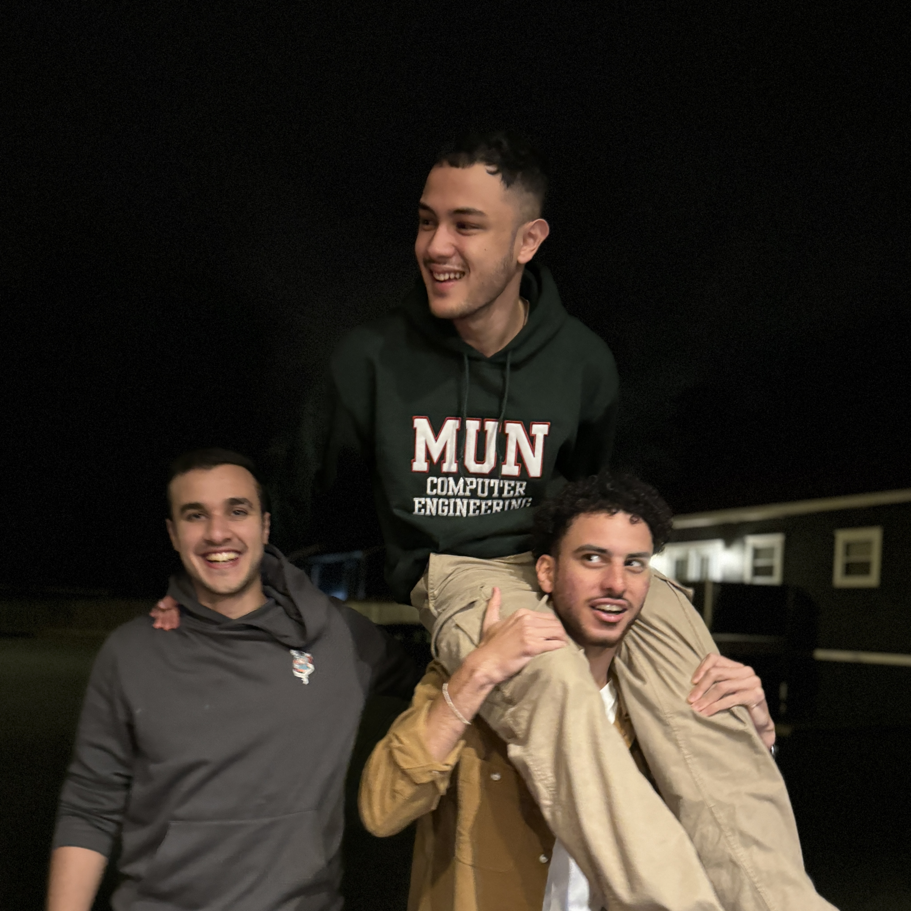

  
___
I'm Shawn, I'm a graduate of Memorial University with a degree in [Computer Engineering](https://www.mun.ca/undergrad/programs/engineering/computer-engineering/).

I have experience working as a Software Engineer designing hospital systems. I also enjoy working with IoT and embedded systems. I helped [launch a cube-satellite](https://themuse.ca/mun-students-celebrate-killick-1-satellites-launch-from-the-iss/) to space and occasionally mess around making games.

Currently, I'm setting up my homelab and learning about reverse-engineering, networks, electronics, and [osdev](https://en.wikipedia.org/wiki/Hobbyist_operating_system).

Beyond tech, I'm a deep admirer of the arts. I love to sketch in my free time, take the odd photograph while I'm out, and hoard different kinds of music. You'll find that we'll always have something to talk about!

> [!IMPORTANT] Hey you!
> I'm currently seeking new opportunities. If you're looking for someone eager to learn and contribute, reach out! I'd love to have a chat 😬
> 
> Send me an email at me@shawn.onl

