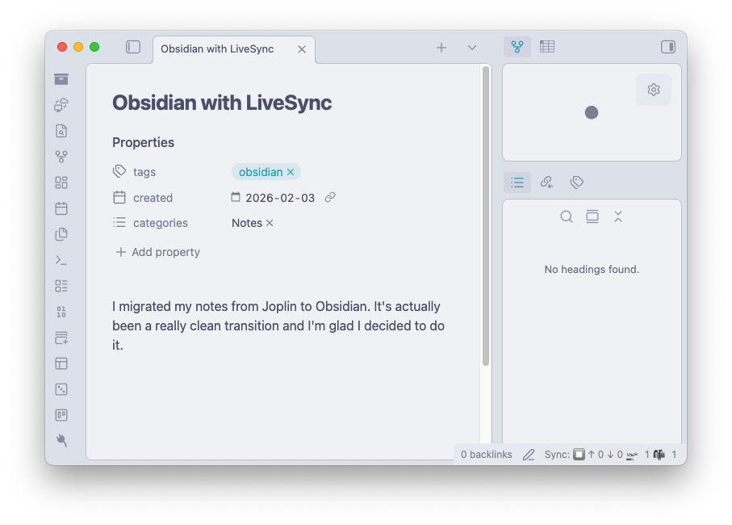
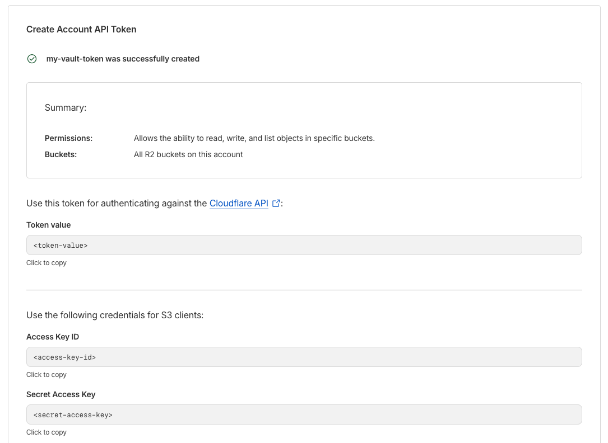
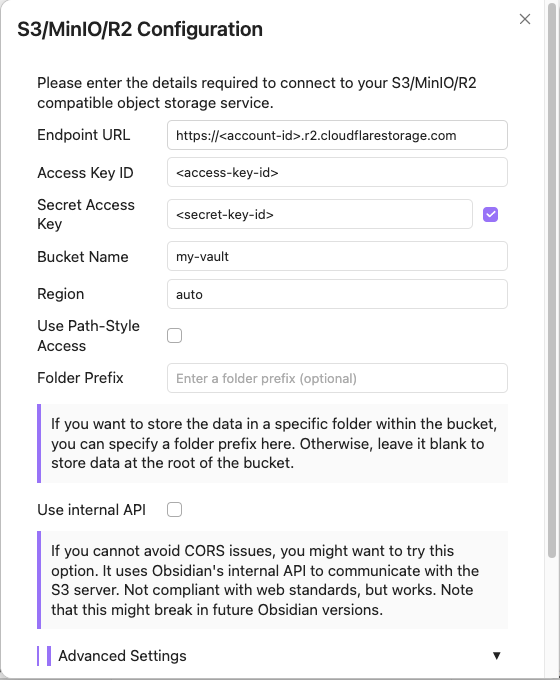
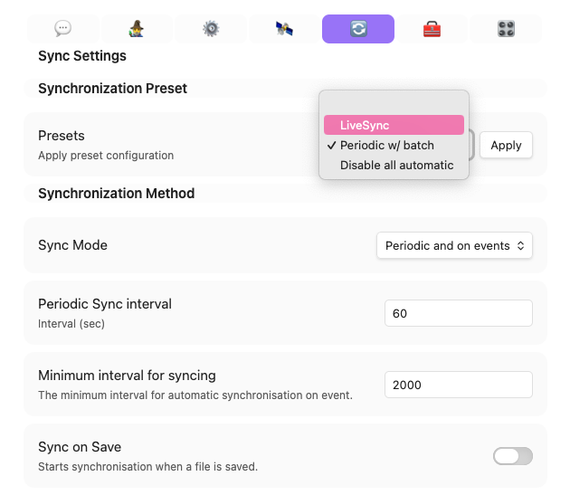

Recently, I migrated away from [Joplin](https://joplinapp.org/) and started using [Obsidian](https://obsidian.md/) for my notes. They're both really good note-taking apps, but Obsidian has been an overall nicer experience. I templated [how Steph Ango writes his notes](https://stephango.com/vault) to help figure out my own workflow.



One thing that I miss about Joplin though is the ability to use Dropbox to sync notes across devices. It's a seamless and free alternative to Joplin's servers, and all I needed was a Dropbox account.
## Syncing Notes
It's not to say that you're stuck with no syncing options.
1. The official [Obsidian Sync](https://obsidian.md/sync) costs $4/mo to get the job done. It's pretty good, since its all integrated within the app anyway and you're supporting the project. If you're just an everyday user who wants the easiest solution, this is probably what you'll go for.
2. Obsidian has a whole ecosystem of community plugins.
	- [Obsidian Git](https://github.com/Vinzent03/obsidian-git) lets you commit and push your notes to a Github repo. Straightforward, but potential merge conflicts? This has its drawbacks...
	- [Remotely Save](https://github.com/remotely-save/remotely-save) lets you use your preferred cloud service as a broker to sync across devices. This one's pretty good, it's just Obsidian Sync with the ability to control *where* your notes are saved.
	- [Self-hosted LiveSync](https://github.com/vrtmrz/obsidian-livesync) works like Remotely Save, but also lets you provide your own backend to store you data. If you have your own VPS/home server, that means *YOU* have full control over your notes.
3. You can also just dump your Obsidian folder into your iCloud or Google Drive or even lug it around in a USB. *But why would you do that?*
## Obsidian Livesync
*Self-hosted LiveSync* let's you set up a CouchDB instance to sync your notes or use S3/MinIO/R2 Object Storage. I went with [Cloudflare R2](https://www.cloudflare.com/en-ca/developer-platform/products/r2/) because you get 10 GB of object storage, which is honestly more than enough for notes. If instead you plan to self host, I recommend reading [this guide](https://blog.kirillov.cc/posts/obsidian-livesync/) by Roman Kirillov.
## Cloudflare setup
1. [Create a Cloudflare account](https://dash.cloudflare.com/sign-up)
2. On the side panel, head to Build → Storage & databases → **R2 object storage**
   and then **set up a free tier**.
3. Create a bucket
	- There should be a button on the top right. Let's name the bucket `my-vault`.
	- You should be taken to the bucket page. *[[#Obsidian setup|This page is important for later]]*
4. Now navigate back to *R2 object storage* and **create an R2 API token**
	- By the **Account Details** section, you can choose to manage your API tokens.
	- Click on **Create Account API token** and name it `my-vault-token`.
	- Specify the permission for the token as **Object Read & Write**.
	- Your **access key ID** and **secret key** will only appear once, so make sure to securely note these down.




5. Now head back to your bucket and head into **Settings** to configure the **CORS Policy**
	- You need to set this up, otherwise you will run into a sync error.
	- Click on **Edit** and copy these headers:
```http
[
  {
    "AllowedOrigins": [
      "*"
    ],
    "AllowedMethods": [
      "GET",
      "PUT",
      "POST",
      "DELETE",
      "HEAD"
    ],
    "AllowedHeaders": [
      "*"
    ],
    "ExposeHeaders": [
      "ETag"
    ],
    "MaxAgeSeconds": 3000
  }
]
```
## Obsidian setup
With your Cloudflare set up, you can now set up the plugin on your first and main device. Yes, essentially where the original vault is kept.
1. Install and enable [**Self-hosted LiveSync**](https://obsidian.md/plugins?id=obsidian-livesync) by vorotamoroz from Community plugins.
2. The **Setup Wizard** 🧙‍♂ will pop up. Select *"I am setting this up for the first time"*.
3. Select *"Enter the server information manually"*
	- You can choose to enable **End-to-End encryption** or not
	- Also to **Obfuscate properties** or not
4. Next, select *"S3/MinIO/R2 Object Storage"*
	- If you've already created a bucket [[#Setting up your object storage|earlier]], you should get the info you need in Cloudflare
	- **Endpoint URL** ← S3 API (something like `https://<account-id>.r2.cloudflarestorage.com`)
	- **Access Key ID** & **Secret Access Key** ← Generated when you created a token
		- If you forgot to save the keys, you can roll the token to get new ones.
	- **Bucket Name** ← `my-vault` or whatever you named your bucket
	- Disable **Use Path-Style Access**
	- You can leave everything else as is



5. Click **Test Settings and Continue**
	- If you ran into a sync error, you probably forgot to configure the CORS policy in the cloudflare bucket. (*See Step 5 of [[#Cloudflare setup]]*)
	- If for some reason this still doesn't work, you can enable the option **Use internal API**
6. Obsidian will reboot to sync for the first time.
	- When you sync for the first time, you will get an error in the log.
	- This is fine. It's just because no config file exists in the remote DB.
## Configuring LiveSync
Once you've completed initial setup, you can explore the plugin to configure some settings.

If you didn't already enable E2E encryption, I suggest setting this up. You can do this by navigating to the **🛰 Remote Configuration** tab. This ensures everything that leaves your device are encrypted with a password. Make sure you don't lose this password, because you probably wouldn't be able to recover your files if you do.

Head to the **🔄 Sync Settings** tab and choose a sync preset. You can either do **LiveSync**, meaning all changes are sync on file save, or **Periodic w/ Batch**, so your vault syncs every given interval.



You can also enable **Advanced Settings** via the **🧙‍♂ Setup** tab. This opens up new options, most notably [[#Customization Sync]].
## Syncing to a new device
Once you're pretty much all done with the main machine, you're going to want to sync to a new device. I mean, that's what all of this is for, right?
1. To sync to a new device, first go to the 🧙‍♂ wizard on the host machine
	- Select **Copy the current settings to a setup URI**
	- Type a password to encrypt the URI (not the vault)
	- You should get a setup URI
2. On the second (or whatever $n^{\text{th}}$) device, install the plugin, and select **Device Setup Method**
	- Select **Use a setup URI (recommended)**
	- Paste the setup URI and passphrase
	- *et-voila!* Remote storage done and dusted...!
## Customization Sync
I'm a messy notetaker and really like barebones, so It's not like I have a lot of plugins and settings. But, I do have my own custom hotkeys and have some core plugins set, so it helps to sync these across my devices too.

If you enabled *Advanced Settings*, you should get a new tab for **🔌 Customization Sync**. Here, you should give your device(s) a unique name. Each device will push a set of their own versions of their config file states to your database.

It's pretty straightforward, but you can read more about it here ([Customization Sync Documentation](https://github.com/vrtmrz/obsidian-livesync/discussions/394)).
## Backing up your notes
Syncing is good and all, but it's just as important to create a backup of your notes. You never know what could happen, so even as simple as having a copy on your drive somewhere or adding it to a git repo every now and then is a good safety net. You don't want to go stressing out if you lose your notes and have no way of recovering them.